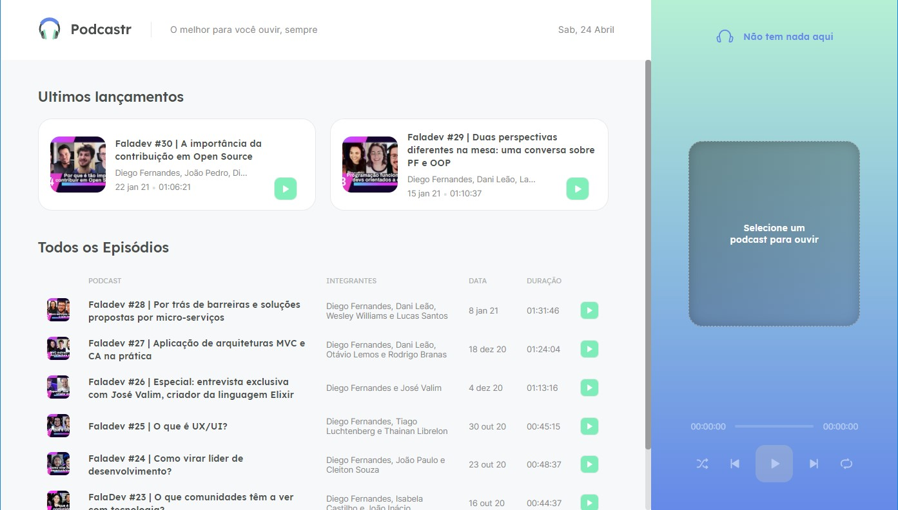

<p align="center">
 <a href="#what">What is it</a> •
 <a href="#technologies">Technologies</a> • 
 <a href="#using">Using</a> • 
 <a href="#building">Build yours</a> • 
 <a href="#author">Author</a>
</p>

<p align="center">
 
 
 
 <span style="border-left: 3px solid #555; margin-right: 2px;"></span>
 
 

</p>


<!-- 
 -->

<p align="center"> 
	🚧  MVP - not fully capable yet...  🚧
</p>

<h1 align="center">
    Typescript React/Next app:
    <p><b>move.it</b></p>
</h1>


A website for showcasing and playing podcasts. Created in the [NLW#5](https://nextlevelweek.com/) event from _19_ to _23 Apr, 2021_.




<h2 id="what" > What is it </h2>

A React/NextJS app developed in a online event [NLW#5](https://nextlevelweek.com/) (Next Level Week, 5th edition), by the programming online school [Rocketseat](https://rocketseat.com.br/).

<br />

### What does it do?

The site showcase episodes of a podcast, standing out the most recent. Each episode has it's own static page, dynamically generated.

You can play an episode with the related button on any of the forms it can be shown: most recent cards, others episodes table, or full info episode page.

The media player on side bar, let you:
- see episode thumbnail, title, and cast.
- pause/play audio
- go next/previous episode
- toggle shuffle on and off
- toggle single episode repetition
- change time with the slider


https://user-images.githubusercontent.com/8677724/115970011-3612d700-a516-11eb-9130-22459b203be0.mp4

You can check it running over [here](https://podcastr-jonatas.vercel.app/)

### What you will find in it

* A section for most recent with two cards
* A section for other episodes, with a table with all info
* Play button on each of those episode's display form
* Sidebar media player mith:
  - Dynamic header, with text and responding to player state (playing / paused / not playing att all)
  - Header's icon with clean animation while playing
  - Holder box with message for empty queue
  - Thumbnail of playing episode
  - Episode's title
  - Episode's cast
  - Time passed label; length indicator bar, with sliding to seek function; and audio time label
  - Control buttons:
    + shuffle
    + go previous
    + play/pause
    + go next
    + repeat
* Dinamicaly generated static pages for each episode, with all it's info
* Dynamic webpage tab title, with player state indicator (playing/pause/none)


https://user-images.githubusercontent.com/8677724/115970615-e9c99600-a519-11eb-9fc4-22cc19c19852.mp4


https://user-images.githubusercontent.com/8677724/115970617-ecc48680-a519-11eb-98df-32b41acd6862.mp4


<h2 id="using" > Using it </h2>

The most recent state of this project is automatically build to [Vercel](vercel.com):

You can run it at: [https://podcastr-jonatas.vercel.app/](https://podcastr-jonatas.vercel.app/)


<h2 id="technologies"> Applyed Technologies </h2>

### This project has the following dependencies

production
- [ReactJS](https://reactjs.org)
- [NextJS](https://nextjs.org)
- [Sass](https://sass-lang.com)
- [Axios](https://www.npmjs.com/package/axios)
- [date-fns](https://www.npmjs.com/package/date-fns)
- [rc-slider](https://www.npmjs.com/package/rc-slider)

development
- [typescript](https://www.typescriptlang.org/)
- [NodeJS](https://nodejs.org/en/)
- [Yarn](https://yarnpkg.com) or [Npm](https://npmjs.com)
- [json-server](https://www.npmjs.com/package/json-server)

### Toolset usage

* Extensive use of React's State and Context APIs
* Using Effect and Refs APIs too.
* Json Rest API consumption/fetching.
* Scss (Sass) modules for advanced component escoped styling.
* Css Flexbox and custom properties (variables).
* NextJS's getServerSideProps for server side renderind.
* And NextJS's getStaticProps for Static Site Generation.
* Svg icons as image. With some animation enabled.

### What to expect to show up later

1. In app volume control
0. Add "repeat queue list" option along repeat one.
0. Dark mode
0. Playing state storing acros reloads for later resuming
0. Share buttons
0. Other themes
0. Converting to WPA to offline listening
0. Alert new launch

<h2 id="building" > Make yourself one of these </h2>

### On Gitpod

The easy way to get your hand at the code, is clone this repo to a cointainer in the cloud.
If you already have an account:

[](https://gitpod.io/#https://github.com/JonatasAmaral/podcastr-next.git)

### On your local machine

To do it locally, you need to install git and NodeJS. I'm using yarn to build, though you can use npm.

```bash
# Clone this repo
$ git clone https://github.com/JonatasAmaral/podcastr-next.git

# Open folder (rename it before, if you want to)
$ cd podcastr-next

# Install/update the dependencies
$ yarn

# Or, for npm
$ npm install

# Get local API up in one terminal (make sure to set baseURL in /src/services/api.ts to htts://localhost:3000 for that to work)
$ yarn server

# Run app in a separate terminal
$ yarn dev

# Or
$ npm dev

# Access localhost
http://localhost:3000
```

<br />
<h2 id="author"> About the author </h2>

Thank's and credits to [Diego Fernandes](https://github.com/diego3g) and his team at [Rocketseat](https://rocketseat.com.br/).


### Jonatas Amaral

[](https://www.linkedin.com/in/anabrtorres/)
[](https://www.artstation.com/jonatasamaral)

[](mailto:anabrtorres19@gmail.com)

<p style="white-space: nowrap">Designer, Computer Engeneering student.<p>
<br style="clear: both; margin-top: 1rem" />

<h2 id="license"> License </h2>

This project is under the [MIT license](https://opensource.org/licenses/MIT).
